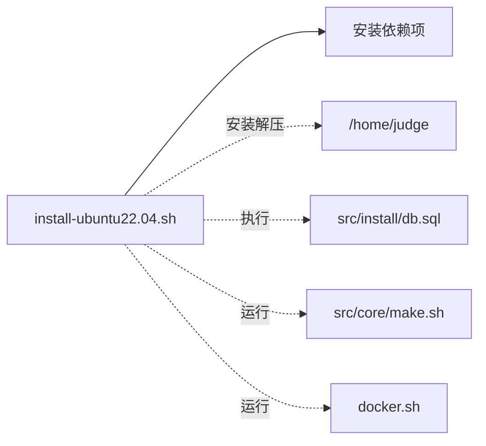
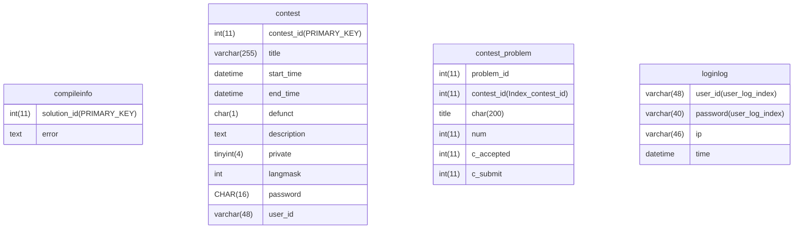
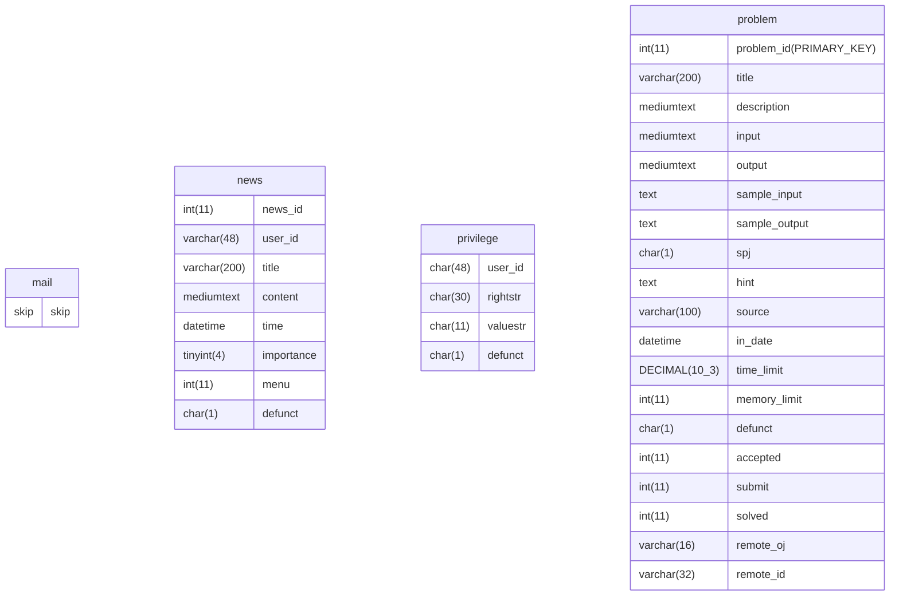
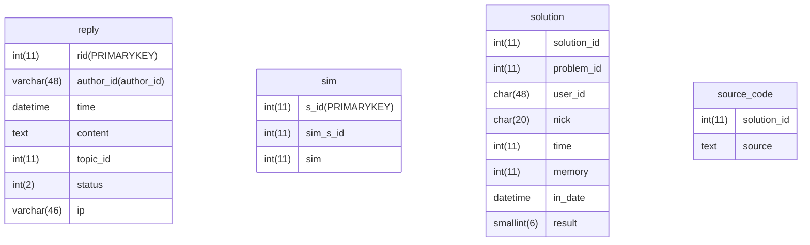
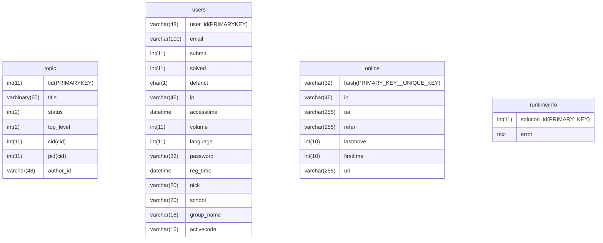
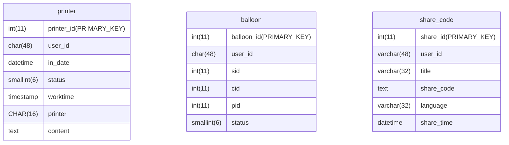
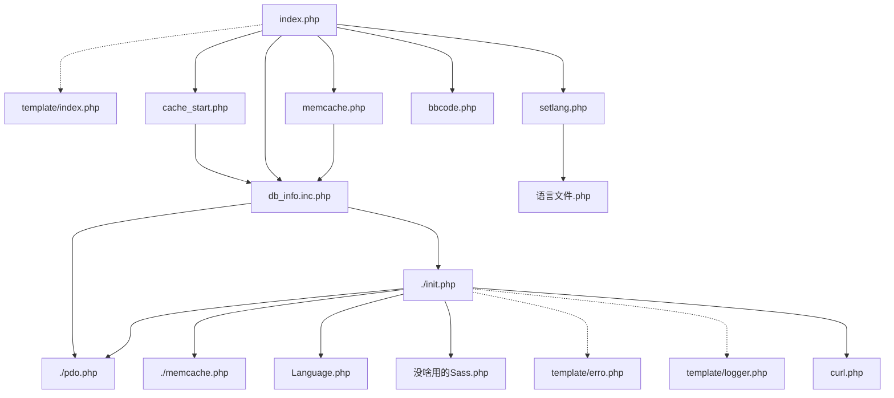

# 安装过程
## 概览




## 运行文件 install/install-ubuntu22.04.sh

```shell
#!/bin/bash
#判断是否是Windows Subsystem for Linux,不支持它
if [ -d /mnt/c ]; then
    echo "WSL is NOT supported."
    exit 1
fi
#判断总的物理内存，尽量大于1G
MEM=`free -m|grep Mem|awk '{print $2}'`
if [ "$MEM" -lt "1000" ] ; then
#忽略此代码的注释，服务器内存小于1GB罕见
        echo "Memory size less than 1GB."
        if grep 'swap' /etc/fstab ; then
                echo "already has swap"
        else
                dd if=/dev/zero of=/swap bs=1M count=1024
                chmod 600 /swap
                mkswap /swap
                swapon /swap
                echo "/swap none swap defaults 0 0 " >> /etc/fstab 
                /etc/init.d/multipath-tools stop
                screen -d -m watch pkill -9 snapd
                screen -d -m watch pkill -9 ds-identify
         fi
else
        echo "Memory size : $MEM MB"
fi
#增加apt的镜像源（阿里和腾讯），加快下载速度
sed -i 's/tencentyun/aliyun/g' /etc/apt/sources.list
sed -i 's/cn.archive.ubuntu/mirrors.aliyun/g' /etc/apt/sources.list
sed -i "s|#\$nrconf{restart} = 'i'|\$nrconf{restart} = 'a'|g" /etc/needrestart/needrestart.conf
#升级apt。开启社区、许可、受驱动限制的存储库，供apt使用。升级apt
apt-get update && apt-get -y upgrade
apt-get install -y software-properties-common
add-apt-repository -y universe
add-apt-repository -y multiverse
add-apt-repository -y restricted
apt-get update && apt-get -y upgrade
#安装“版本控制系统”软件
apt-get install -y subversion
#创建普通用户 自动建立用户的登入目录，指定ID为1536
/usr/sbin/useradd -m -u 1536 judge
#进入目录
cd /home/judge/ || exit
#下载安装包并解压
wget -O hustoj.tar.gz http://dl.hustoj.com/hustoj.tar.gz
tar xzf hustoj.tar.gz
#“版本控制系统”更新src目录
svn up src
#安装软件包，供C++交互MySQL
apt-get install -y libmysqlclient-dev
apt-get install -y libmysql++-dev
apt-get install -y libmariadb-dev libmariadbclient-dev libmariadb-dev
#获得PHP的版本号，如果为空，定义为8.1
PHP_VER=`apt-cache search php-fpm|grep -e '[[:digit:]]\.[[:digit:]]' -o`
if [ "$PHP_VER" = "" ] ; then PHP_VER="8.1"; fi
#安装各种所需依赖
for pkg in net-tools make g++ php$PHP_VER-fpm nginx php$PHP_VER-mysql php$PHP_VER-common php$PHP_VER-gd php$PHP_VER-zip php$PHP_VER-mbstring php$PHP_VER-xml php$PHP_VER-curl php$PHP_VER-intl php$PHP_VER-xmlrpc php$PHP_VER-soap php-yaml php-apcu tzdata
#安装失败时，重试安装操作
do
        while ! apt-get install -y "$pkg"
        do
                dpkg --configure -a
                apt-get install -f
                echo "Network fail, retry... you might want to change another apt source for install"
        done
done
#安装mariadb（MySQL分支），启动php、mariadb、nginx
apt-get install -y mariadb-server
service php$PHP_VER-fpm start
service mariadb start
service nginx start
#将/home/judge文件或目录的组所有权更改为www-data组。确保Web服务器可以读取和执行这个目录下的文件
chgrp www-data  /home/judge
#定义用户名、密码
USER="hustoj"
PASSWORD=`tr -cd '[:alnum:]' < /dev/urandom | fold -w30 | head -n1`
#执行SQL语句
mysql < src/install/db.sql
#删除指定MySQL用户
echo "DROP USER $USER;" | mysql
#创建用户，赋予用户对JOL数据库的所有权限。刷新权限，立即赋予权限
echo "CREATE USER $USER identified by '$PASSWORD';grant all privileges on jol.* to $USER ;flush privileges;"|mysql
#获取CPU的核心数和系统的内存总量
CPU=$(grep "cpu cores" /proc/cpuinfo |head -1|awk '{print $4}')
MEM=`free -m|grep Mem|awk '{print $2}'`
#如果内存小于1GB，就……
if [ "$MEM" -lt "1000" ] ; then
        echo "Memory size less than 1GB."
        if grep 'key_buffer_size        = 1M' /etc/fstab ; then
                echo "already trim config"
        else
                sed -i 's/#key_buffer_size        = 128M/key_buffer_size        = 1M/' /etc/mysql/mariadb.conf.d/50-server.cnf
                sed -i 's/#table_cache            = 64/#table_cache            = 5/' /etc/mysql/mariadb.conf.d/50-server.cnf
                sed -i 's/#skip-name-resolve/skip-name-resolve/' /etc/mysql/mariadb.conf.d/50-server.cnf
                service mariadb restart
                free -h
        fi
else
        echo "Memory size : $MEM MB"
fi
#创建3个文件夹
mkdir etc data log backup
#复制文件，赋予shell文件、ans2out文件执行权限
cp src/install/java0.policy  /home/judge/etc
cp src/install/judge.conf  /home/judge/etc
chmod +x src/install/ans2out /home/judge/src/install/*.sh
# 为每个 CPU 内核创建足够的 runX 目录
if grep "OJ_SHM_RUN=0" etc/judge.conf ; then
        for N in `seq 0 $(($CPU-1))`
        do
           mkdir run$N
           chown judge run$N
        done
fi
#在配置文件中，增加用户、密码、权限、CPU核心数语句。为每个用户的代码创建一个独立的文件系统环境，从而防止代码对系统造成破坏或干扰其他用户
sed -i "s/OJ_USER_NAME=.*/OJ_USER_NAME=$USER/g" etc/judge.conf
sed -i "s/OJ_PASSWORD=.*/OJ_PASSWORD=$PASSWORD/g" etc/judge.conf
sed -i "s/OJ_COMPILE_CHROOT=1/OJ_COMPILE_CHROOT=0/g" etc/judge.conf
sed -i "s/OJ_RUNNING=1/OJ_RUNNING=$CPU/g" etc/judge.conf
#所有者权限：读、写、运行
chmod 700 backup
chmod 700 etc/judge.conf
#递归指定etc的所有组和所有者为root
chown -R root:root etc
#在db_info（总的配置文件中），显示用户名密码
sed -i "s/DB_USER[[:space:]]*=[[:space:]]*\".*\"/DB_USER=\"$USER\"/g" src/web/include/db_info.inc.php
sed -i "s/DB_PASS[[:space:]]*=[[:space:]]*\".*\"/DB_PASS=\"$PASSWORD\"/g" src/web/include/db_info.inc.php
#文件所有者具有读、写、执行的权限
chmod 700 src/web/include/db_info.inc.php
#更改web（网页端）及子目录的拥有者设置为用户www-data，用户组:www-data
chown -R www-data:www-data src/web/
#更改svn（版本控制系统）及子目录的拥有者设置为用户root，用户组root
chown -R root:root src/web/.svn
#将svn2（版本控制系统）的权限设置为，所有者读写执行，用户组读、执行，其他用户没有权限
chmod 750 -R src/web/.svn2
#更改src/web/upload及子目录的拥有者设置为用户www-data，用户组www-data
chown www-data:www-data src/web/upload
#更改data及子目录的拥有者设置为用户www-data，用户组judge
chown www-data:judge data
#将data的权限设置为，所有者读写执行，用户组读、执行，其他用户没有权限
chmod 750 -R data
#将nginx的请求体最大设置为280m（先查询配置文件，若没有则新增）
if grep "client_max_body_size" /etc/nginx/nginx.conf ; then
        echo "client_max_body_size already added" ;
else
        sed -i "s:include /etc/nginx/mime.types;:client_max_body_size    280m;\n\tinclude /etc/nginx/mime.types;:g" /etc/nginx/nginx.conf
fi
#MySQL根据用户名密码登录，执行插入数据库语句（也就是，通过管道 |，将 SQL 插入语句传递给 mysql 客户端命令）
echo "insert into jol.privilege values('admin','administrator','true','N');"|mysql -h localhost -u"$USER" -p"$PASSWORD"
echo "insert into jol.privilege values('admin','source_browser','true','N');"|mysql -h localhost -u"$USER" -p"$PASSWORD"
#配置Nginx
if grep "added by hustoj" /etc/nginx/sites-enabled/default ; then
        echo "default site modified!"
else
        echo "modify the default site"
        #（全局替换）网络端在/home/judge/src/web文件夹中
        sed -i "s#root /var/www/html;#root /home/judge/src/web;#g" /etc/nginx/sites-enabled/default
		#（全局替换）将默认的主页（index）设置为index.html,index.php
        sed -i "s:index index.html:index index.php:g" /etc/nginx/sites-enabled/default
        #替换的目的是，去除注释#location ~ \.php $
        sed -i "s:#location ~ \\\.php\\$:location ~ \\\.php\\$:g" /etc/nginx/sites-enabled/default
        #替换的目的是，去除注释
        sed -i "s:#\tinclude snippets:\tinclude snippets:g" /etc/nginx/sites-enabled/default
        #替换的目的是，去除注释
        sed -i "s|#\tfastcgi_pass unix|\tfastcgi_pass unix|g" /etc/nginx/sites-enabled/default
        #将#added by hustoj，替换为空
        sed -i "s:}#added by hustoj::g" /etc/nginx/sites-enabled/default
        #将php7.4替换为php的版本
        sed -i "s:php7.4:php$PHP_VER:g" /etc/nginx/sites-enabled/default
        #将# deny access to .htaccess files，替换为}#added by hustoj    # deny access to .htaccess files
        sed -i "s|# deny access to .htaccess files|}#added by hustoj\n\n\n\t# deny access to .htaccess files|g" /etc/nginx/sites-enabled/default
        #将前者替换为后者，定义了响应头的缓冲区大小为256KB，主体有32个64KB的缓冲区
        sed -i "s|fastcgi_pass 127.0.0.1:9000;|fastcgi_pass 127.0.0.1:9000;\n\t\tfastcgi_buffer_size 256k;\n\t\tfastcgi_buffers 32 64k;|g" /etc/nginx/sites-enabled/default
fi
#重启nginx服务
/etc/init.d/nginx restart
#替换php的post的最大值为180MB
sed -i "s/post_max_size = 8M/post_max_size = 180M/g" /etc/php/$PHP_VER/fpm/php.ini
#替换php的上传文件的最大值为180MB
sed -i "s/upload_max_filesize = 2M/upload_max_filesize = 180M/g" /etc/php/$PHP_VER/fpm/php.ini
#不知道，配置文件相关?
WWW_CONF=$(find /etc/php -name www.conf)
#一个请求可以运行的最长时间为128秒
sed -i 's/;request_terminate_timeout = 0/request_terminate_timeout = 128/g' "$WWW_CONF"
#进程池最多有600个子进程
sed -i 's/pm.max_children = 5/pm.max_children = 600/g' "$WWW_CONF"
#CPU芯片每秒钟能够处理的指令数量,取第一行，:作为分隔符。修正CPU速度（即修正程序的运行限制时间）
COMPENSATION=$(grep 'mips' /proc/cpuinfo|head -1|awk -F: '{printf("%.2f",$2/3000)}')
sed -i "s/OJ_CPU_COMPENSATION=1.0/OJ_CPU_COMPENSATION=$COMPENSATION/g" etc/judge.conf
#查找名为php版本号-fpm的文件，并重启它
PHP_FPM=$(find /etc/init.d/ -name "php*-fpm")
$PHP_FPM restart
#如果找到了PHP FPM，就重启
PHP_FPM=$(service --status-all|grep php|awk '{print $4}')
if [ "$PHP_FPM" != ""  ]; then service "$PHP_FPM" restart ;else echo "NO PHP FPM";fi;
#进入src/core 核心文件夹
cd src/core || exit
#给予全部人执行权限，并运行
chmod +x ./make.sh
./make.sh
#开机自启/usr/bin/judged
if grep "/usr/bin/judged" /etc/rc.local ; then
        echo "auto start judged added!"
else
        sed -i "s/exit 0//g" /etc/rc.local
        echo "/usr/bin/judged" >> /etc/rc.local
        echo "exit 0" >> /etc/rc.local
fi
#添加自动备份
if grep "bak.sh" /var/spool/cron/crontabs/root ; then
        echo "auto backup added!"
else
		#每天凌晨一点执行自动备份
        crontab -l > conf && echo "1 0 * * * /home/judge/src/install/bak.sh" >> conf && crontab conf && rm -f conf
        /etc/init.d/cron reload
fi
#创建符号软链接，即快捷方式
ln -s /usr/bin/mcs /usr/bin/gmcs
#运行程序
/usr/bin/judged
#复制粘贴系统服务的启动脚本
cp /home/judge/src/install/hustoj /etc/init.d/hustoj
#hustoj将在大多数常见的运行级别中启动和停止
update-rc.d hustoj defaults
#当系统启动时，自动启动如下服务
systemctl enable hustoj
systemctl enable nginx
systemctl enable mariadb
#（php的进程池服务）
systemctl enable php$PHP_VER-fpm
#systemctl enable judged
#启动MariaDB（比MySQL强,是MySQL的分支）的服务
/etc/init.d/mariadb start
#创建文件夹
mkdir /var/log/hustoj/
#更改www-data为所有者
chown www-data -R /var/log/hustoj/
#进入/home/judge/src/install目录
cd /home/judge/src/install
#docker.sh，关于docker的脚本
if test -f  /.dockerenv ;then
        echo "Already in docker, skip docker installation, install some compilers ... "
        apt-get intall -y flex fp-compiler openjdk-14-jdk mono-devel
else
        sed -i 's/ubuntu:20/ubuntu:22/g' Dockerfile
        sed -i 's|/usr/include/c++/9|/usr/include/c++/11|g' Dockerfile
        bash docker.sh
fi
#设置变量，以便显示
IP=`curl http://hustoj.com/ip.php`
LIP=`ip a|grep inet|grep brd|head -1|awk '{print $2}'|awk -F/ '{print $1}'`
#清除屏幕，重新初始化终端
clear
reset

echo "Remember your database account for HUST Online Judge:"
echo "username:$USER"
echo "password:$PASSWORD"
echo "DO NOT POST THESE INFORMATION ON ANY PUBLIC CHANNEL!"
echo "Register a user as 'admin' on http://127.0.0.1/ "
echo "打开http://127.0.0.1/ 或者 http://$IP  或者 http://$LIP 注册用户admin，获得管理员权限。"
echo "如果无法打开页面或无法注册用户，请检查上方数据库账号是否能正常连接数据库。"
echo "如果发现数据库账号登录错误，可用sudo bash /home/judge/src/install/fixdb.sh 尝试修复。"
echo "遇到服务器内部错误500，查看/var/log/nginx/error.log末尾，寻找详细原因。"
echo "更多问题请查阅http://hustoj.com/"
echo "不要在QQ群或其他地方公开发送以上信息，否则可能导致系统安全受到威胁。"

```

## 运行 src/core/make.sh

```sh
#!/bin/bash
#执行judged的makefile文件，添加全部人的运行权限，复制到可执行程序目录
cd judged
make
chmod +x judged
cp judged /usr/bin
#执行judge_client的makefile文件，添加全部人的运行权限，复制到可执行程序目录
cd ../judge_client
make
chmod +x judge_client
cp judge_client /usr/bin
#编译“查重”，复制到可执行程序目录，并给予运行权限
cd ../sim/sim_3_01
make fresh
make exes
chmod +x sim*
cp sim_c.exe /usr/bin/sim_c
cp sim_c++.exe /usr/bin/sim_cc
cp sim_java.exe /usr/bin/sim_java
cp sim_pasc.exe /usr/bin/sim_pas
cp sim_text.exe /usr/bin/sim_text
cp sim_lisp.exe /usr/bin/sim_scm
cd ..
cp sim.sh /usr/bin
chmod +x /usr/bin/sim.sh
#ln -fs /usr/bin/sim_c /usr/bin/sim_cc 2>&1 > /dev/null
echo "done!"
```

## 运行src/install/db.sql

```mysql
set names utf8mb4; -- 占据更多的存储空间，但是显示特殊符号
int(11) -- 显示宽度为11，不影响int空间
varchar(48) -- 变长存储，更节省空间，但速度慢
mediumtext -- 可以存储2^24-1个字符
tinyint(4) -- 大小 1 byte
smallint(6) -- [-2^15,2^15–1]2个byte
varbinary(60) -- 变长，最多60个字节
defunct -- 僵尸进程
DECIMAL(10,3) -- 总位数最多10位，小数点3位
collate utf8mb4_unicode_ci -- 排序方式
datetme -- '1000-01-01 00:00:00.000000' to '9999-12-31 23:59:59.999999'
timestamp -- '1970-01-01 00:00:01.000000' to '2038-01-19 03:14:07.999999'
```










## 运行docker.sh

judge镜像仍处于不稳定状态，故不再使用

```dockerfile
docker run -d \
    --network hustoj \
    --name hustoj.mysql \
    -e MYSQL_USER=<mysql_username> \
    -e MYSQL_PASSWORD=<mysql_password> \
    -v mysql:/var/lib/mysql \
    registry.gitlab.com/mgdream/hustoj:mysql
```

# web端

## php文件依赖关系



